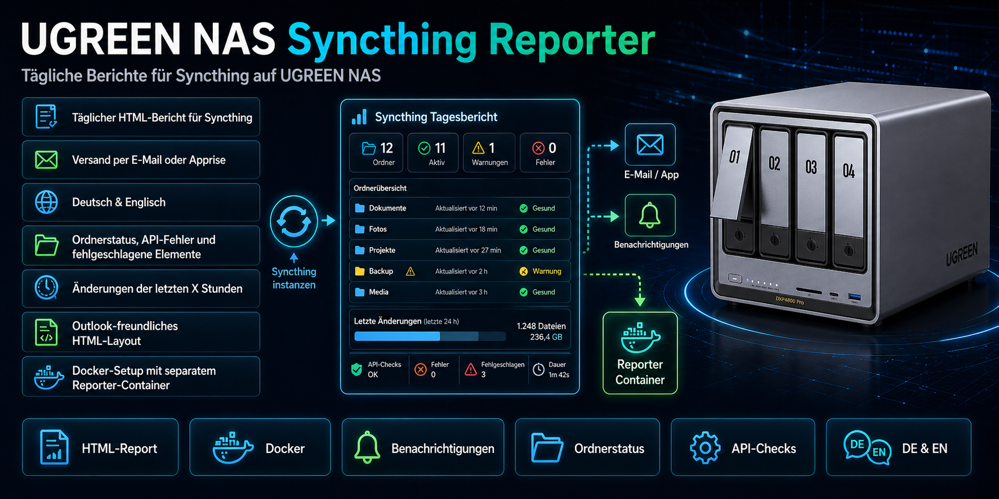

# UGREEN NAS Syncthing Reporter



Der UGREEN NAS Syncthing Reporter ist ein leichtgewichtiges Docker-Paket für Syncthing. Es erstellt täglich einen HTML-Bericht und kann diesen per SMTP oder Apprise versenden.

Das Paket unterstützt Deutsch und Englisch über `REPORT_LANG=de` oder `REPORT_LANG=en` und ist besonders für UGREEN NAS mit UGOS geeignet. Es funktioniert grundsätzlich auch auf anderen Docker-Hosts.

## Features

- Täglicher HTML-Bericht für Syncthing
- Versand per SMTP oder Apprise
- Deutsch und Englisch in einem Projekt
- Übersicht zu Ordnerstatus, API-Fehlern und fehlgeschlagenen Elementen
- Auswertung der Änderungen der letzten X Stunden über `WINDOW_HOURS`
- Outlook-freundliches HTML-Layout
- Vorgebautes Docker-Image über GitHub Container Registry
- Lokale Build-Variante für Entwickler und Sonderfälle
- GitHub Actions Workflow für automatischen Image-Build und Trivy-Scan
- Dependabot-Konfiguration für Dockerfile, Python-Abhängigkeiten und GitHub Actions

## Docker-Image

Standardmäßig verwendet die Compose-Datei dieses Image:

```text
ghcr.io/railsimulatornet/ugreen-nas-syncthing-reporter:latest
```

Dadurch kann der Reporter per `docker compose pull` oder über die UGOS-Docker-App aktualisiert werden, sobald ein neues Image veröffentlicht wurde.

### Versions- und Buildbezeichnungen

Der Image-Pfad bleibt unverändert. Neue Images erhalten folgende Tags:

| Tag | Bedeutung |
| --- | --- |
| `2.2.2` | Feste Release-Version; wird nicht durch spätere Wartungsbuilds überschrieben. |
| `latest` | Aktueller geprüfter Build für bestehende Installationen. |
| `2.2.2-build.20260927.26.1` | Beispiel eines Wartungsbuilds: Version, Datum, Buildnummer und Wiederholungsnummer. |

Die Kurzformen `2.2` und `2` folgen neuen Releases ihrer Versionsreihe. Wöchentliche Rebuilds erhalten eine eigene Buildbezeichnung und aktualisieren `latest`, aber keine festen Release-Tags. Der genaue Quellstand bleibt im Image-Metadatum `org.opencontainers.image.revision` nachvollziehbar. Bestehende `sha-…`-Tags bleiben erhalten; neue werden nicht mehr erzeugt.

## Projektstruktur

```text
UGREEN-NAS-Syncthing-Reporter/
├─ README.md
├─ LICENSE
├─ VERSION
├─ .gitignore
├─ .github/
│  ├─ dependabot.yml
│  ├─ release-title.txt
│  ├─ release-notes.md
│  ├─ scripts/
│  └─ workflows/
│     └─ docker-publish.yml
├─ Screens/
│  ├─ DE_Mail.jpg
│  └─ DE_MailMobil.jpg
└─ syncthing/
   ├─ .env.example
   ├─ docker-compose.yaml
   ├─ docker-compose.local-build.yaml
   ├─ scripts/
   │  ├─ update_reporter.sh
   │  ├─ rebuild_reporter_local.sh
   │  └─ security_scan_reporter.sh
   ├─ syncthing/
   │  └─ config/
   │     └─ PLACEHOLDER.txt
   └─ syncthing_reporter_py/
      ├─ .dockerignore
      ├─ Dockerfile
      ├─ entry.sh
      ├─ report.py
      ├─ requirements.txt
      └─ scheduler.sh
```

## Quickstart

1. Kopiere den Ordner `syncthing` auf dein NAS oder deinen Docker-Host.
2. Kopiere `syncthing/.env.example` nach `syncthing/.env`.
3. Passe die Werte in `.env` an deine Umgebung an.
4. Ergänze bei Bedarf eigene Syncthing-Datenpfade in `docker-compose.yaml`.
5. Starte den Stack:

```bash
cd syncthing
docker compose pull
docker compose up -d
```

## Update

```bash
cd syncthing
docker compose pull
docker compose up -d
```

Alternativ kann auf UGOS das Projekt in der Docker-App neu bereitgestellt werden. Dabei sollte das neueste Image abgerufen werden.

Bei bestehenden UGOS-Projekten kann der Projektname vom Ordnernamen abweichen. Für SSH-Updates den tatsächlichen Namen aus dem Container-Label `com.docker.compose.project` verwenden und mit `docker compose -p` explizit angeben. Die eigene `.env` und vorhandene Daten nicht überschreiben.

## Lokaler Build

Für lokale Tests oder angepasste Builds kann die lokale Build-Compose-Datei verwendet werden:

```bash
cd syncthing
docker compose -f docker-compose.local-build.yaml build --pull --no-cache syncthing_reporter_py
docker compose -f docker-compose.local-build.yaml up -d
```

Alternativ:

```bash
cd syncthing
chmod +x scripts/rebuild_reporter_local.sh
./scripts/rebuild_reporter_local.sh 2.2.2
```

## Security-Scan des Reporter-Images

```bash
cd syncthing
chmod +x scripts/security_scan_reporter.sh
./scripts/security_scan_reporter.sh
```

Die Ergebnisse werden unter `syncthing_reporter_py/state/security/` abgelegt.

## GitHub Container Registry

Das Docker-Image wird durch GitHub Actions gebaut und in GitHub Container Registry veröffentlicht. Der Workflow läuft bei Änderungen am Reporter-Code, bei Tags, manuell und zusätzlich geplant wöchentlich.

Eine neue Versionsnummer in `VERSION` wird beim Push auf `main` nach erfolgreichen Prüfungen als festes Image und GitHub-Release mit ZIP-Paket, DE/EN-Handbuch und Prüfsummen veröffentlicht, sofern der zugehörige Git-Tag noch nicht existiert. Titel und Beschreibung stehen in `.github/release-title.txt` und `.github/release-notes.md`. Geplante und manuelle Wartungsbuilds erstellen keinen neuen GitHub-Release. Bereits veröffentlichte Versions-Tags und Release-Dateien werden nicht überschrieben.

## Lizenz

Dieses Projekt steht unter der **MIT License**.

## Dokumentation

Das ausführliche Handbuch liegt als PDF im Repository: `UGREEN_Syncthing_Reporter_Handbuch_DE-EN.pdf`

## Version

- Reporter-Version: V2.2.2
- Docker-Image: `ghcr.io/railsimulatornet/ugreen-nas-syncthing-reporter:latest`
- Build-Stand im Paket: 2026-09-27

## English note

This project is licensed under the **MIT License**.

This repository contains a bilingual German and English Syncthing reporting package for Docker. The runtime language can be switched with `REPORT_LANG=de` or `REPORT_LANG=en`.

The image path and `latest` tag remain unchanged. Full release tags such as `2.2.2` are fixed. Weekly rebuilds receive readable tags such as `2.2.2-build.20260927.26.1` and update `latest` without overwriting release versions. Existing SHA-based tags are retained.
